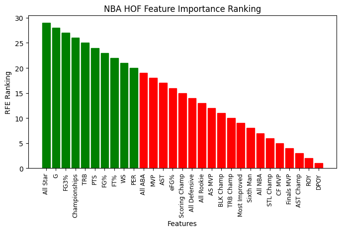
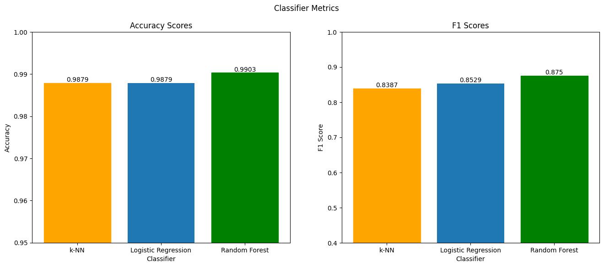

# NBA Hall of Fame Analysis
## Objective
The goal of this project is to train a model that can accurately predict whether an NBA player will be inducted into the NBA Hall of Fame. 

The dataset used in this project can be downloaded from this [Kaggle Link](https://www.kaggle.com/datasets/ryanschubertds/all-nba-aba-players-bio-stats-accolades). The dataset contains 4980 players and 39 features in total, but I will be narrowing it down to just 10 features. 

The models I have decided to use are the K-Nearest Neighbors Classifier, the Logistic Regression Classifier, and the Random Forest Classifier. At the end of the project, I will use the best classifier to predict which current NBA players have a shot at making the Hall of Fame.

## Preprocessing
The first thing I did was create a class column for the dataset. While there is no column indicating whether a player is in the Hall of Fame or not, I leveraged the fact that players who had an asterisk ‘*’ at the end of their names were in the Hall of Fame to create the true labels.
Next, I separated players who are retired for 4+ years from the players who are not. This is because only the former group can be inducted into the Hall of Fame. My training and testing will be done on the former group of players.

Then, I used the RFECV selector from sklearn to select the 10 best features from the 39 total. I ended up including the following features: All Star, G, FG3%, Championships, TRB, PTS, FG%, FT%, WS, and PER. Most of these attributes made sense to me like the number of All-Star appearances, a player’s win shares, and the number of championships. Other features like total rebounds and free throw percentage were a bit surprising to me. Regardless, I used these 10 features going forward.

After splitting the preprocessed data into a subsets of 80% training data and 20% testing data, I was ready to implement the models. 

## Models
After implementing all three models, I found that the Random Forest Classifier performed the best. It had both the highest accuracy at 0.990, and the highest f1 score at 0.875. However, the other models displayed comparable results. The metric used to compare the models was f1 score because it is a better metric for imbalanced datasets than accuracy.

## Results
Using the trained Random Forest Classifier on unretired/recently retired players, I found that these players are predicted to enter the Hall of Fame.

* LaMarcus Aldridge
* Giannis Antetokounmpo
* Carmelo Anthony
* Jimmy Butler
* Vince Carter
* Stephen Curry
* Anthony Davis
* DeMar DeRozan
* Kevin Durant
* Joel Embiid
* Pau Gasol
* Paul George
* Draymond Green
* Blake Griffin
* James Harden
* Al Horford
* Dwight Howard
* Kyrie Irving
* LeBron James
* Joe Johnson
* Nikola Jokić
* Kawhi Leonard
* Damian Lillard
* Kevin Love
* Kyle Lowry
* Paul Millsap
* Dirk Nowitzki
* Tony Parker
* Chris Paul
* Dwyane Wade
* Russell Westbrook

